# True Voice — Phase 1 Completion Report
## Developer: Jayanth | Smart India Hackathon 2026

> **Date**: 11 September 2026  
> **Status**: ✅ Phase 1 Complete — Live-Verified on Samsung SM-M515F (Galaxy M51) over Jio/Airtel

---

### 1. Phase 1 Achievements (What We Built & Proved)

#### ✅ A. Full Call Recording to Storage (Sink 1)
- **What it does**: Every carrier call is automatically captured and saved as a single `.ogg` file (Opus codec, 48kHz stereo) into the user's `CallRecorder/` folder on the phone.
- **How it works**: `ScrcpyAudioMuxer` receives raw Opus packets from `scrcpy-server` (via Shizuku shell bridge) and writes them directly into an OGG container using Android's native `MediaMuxer`.
- **Verified**: Live Jio/Airtel calls produce clean, playable `.ogg` recordings in the phone's storage.

#### ✅ B. In-Memory 3-Second Sliding Window (Sink 2 — The Core Innovation)
- **What it does**: Simultaneously with Sink 1, every audio packet is intercepted in RAM and decoded into raw PCM for real-time AI analysis. **Zero temporary files are ever written to disk.**
- **Pipeline flow**:
  ```
  Opus 48kHz Packet → MediaCodec Decoder → 48kHz Stereo 16-bit PCM
      → AudioResampler (3:1 decimation + stereo-to-mono downmix)
      → 16kHz Mono Float32 PCM [-1.0, 1.0]
      → PcmRingBuffer (circular buffer holding latest 3.0 seconds)
  ```
- **Verified via Logcat** (live Jio call on 11 Sep 2026):
  ```
  [TrueVoice] LiveAnalysisSink initialized: opus 48000 Hz, 2 ch -> 16kHz mono ring buffer
  [TrueVoice Telemetry] Live PCM: Active=true | Rate=50 pkt/s | Buffer=3.00s / 3.0s | RMS=0.2346 | Decoded=192640 samples
  ```
- **Key metrics from the live test call (~31 seconds)**:
  - Packet delivery rate: **50 pkt/s (perfect, 0% loss)** — matches exactly 20ms Opus frame intervals
  - Buffer fill: **3.00s / 3.0s** — ring buffer fully populated within 4 seconds of call start
  - Total samples decoded: **482,560** (at 16kHz = 30.16 seconds of decoded audio)
  - RMS energy ranged from **0.0006** (silence) to **0.2346** (active speech) — proving real voice audio was decoded, not zeroes

#### ✅ C. Real-Time Acoustic Energy Monitoring (RMS)
- Each resampled audio chunk has its Root Mean Square energy computed inline.
- This provides a **basic voice presence indicator** without any ML model:
  - RMS < 0.01 → Silence / background
  - RMS > 0.05 → Speech detected
- This will be superseded by the neural Silero VAD in Phase 2, but serves as a useful sanity check and fallback.

#### ✅ D. Live Pipeline Health Telemetry (`AudioTelemetry.kt`)
- Thread-safe atomic counters track:
  - `totalPacketsReceived` — cumulative packet count
  - `packetsPerSecond` — rolling 1-second rate (expected: ~50 for Opus)
  - `totalPcmSamplesDecoded` — cumulative 16kHz mono samples decoded
  - `bufferDurationSeconds` — current ring buffer fill level
  - `currentRmsEnergy` — latest audio chunk energy
  - `lastError` — most recent error string (null if healthy)
- Telemetry is logged every 2 seconds during active calls for non-intrusive monitoring.

#### ✅ E. Dual-Sink Fan-Out in `AudioRecordingEngine.kt`
- The `ScrcpyClient.AudioPacketListener` now routes every packet to two independent sinks:
  - **Sink 1**: `scrcpyAudioMuxer?.writePacket(...)` — Storage path (unchanged from original ShizuCallRecorder)
  - **Sink 2**: `liveAnalysisSink.enqueuePacket(...)` — In-memory analysis path (new)
- Both sinks are fully decoupled: if the decoder crashes, recording continues; if the muxer fails, analysis continues.

#### ✅ F. Documentation & Team Collaboration
- [`docs/TRUE_VOICE_SIH_MASTER_PLAN.md`](file:///d:/AI-Voice-Clone-Detector/docs/TRUE_VOICE_SIH_MASTER_PLAN.md) — Full architecture, tech stack, demo script, and production roadmap.
- [`context/SIH_TEAM_CONTEXT.md`](file:///d:/AI-Voice-Clone-Detector/context/SIH_TEAM_CONTEXT.md) — Shared team & AI context guide with architectural decisions and codebase navigation.
- All changes committed and pushed to `origin/main`.

---

### 2. Known Gaps & Limitations (Phase 1)

| Gap | Impact | Resolution Phase |
| :--- | :--- | :--- |
| **No Neural VAD**: RMS energy is a crude voice detector. It cannot distinguish speech from music, TV noise, or consistent background hum. | May trigger unnecessary AI inference on non-speech audio segments, wasting CPU. | Phase 2 (Silero VAD ONNX) |
| **No AI Model Connected**: The 3-second audio window exists in RAM but nothing evaluates it for synthetic/cloned voice markers yet. | No deepfake detection capability — the ring buffer is "listening" but not "thinking." | Phase 2 (AASIST-Lite / MobileNetV3 ONNX) |
| **Audio Source Not Switched to Downlink**: The current build uses `VOICE_CALL` (both sides mixed). The architecture specifies `VOICE_CALL_DOWNLINK` for pure caller isolation. | The user's own voice leaks into the analysis buffer, which can confuse anti-spoofing models and raise false positives. | Phase 2 (Audio source configuration) |
| **Full Universal Analysis (No Whitelist Bypass)**: By design, every call is analyzed regardless of caller identity to protect against Caller ID spoofing and SIM swap attacks. | Ensures zero blind spots, but requires lightweight on-device inference (VAD gating) to remain energy-efficient. | Phase 2 (Silero VAD ONNX gating) |
| **No Floating Security HUD**: The existing overlay is the original ShizuCallRecorder recording indicator, not a risk-score display. | No real-time visual feedback to the user about voice authenticity or scam risk during the call. | Phase 3 (Compose Overlay Redesign) |
| **No Community Threat Backend**: No pre-call reputation lookup or post-call scam reporting. | No collective defense — each user is isolated. | Phase 4 (FastAPI Backend) |

---

### 3. Files Created / Modified in Phase 1

#### New Files (Package: `com.truevoice.audio`)
| File | Lines | Purpose |
| :--- | :--- | :--- |
| `AudioTelemetry.kt` | ~100 | Thread-safe pipeline health counters and snapshot reporting |
| `PcmRingBuffer.kt` | ~90 | Circular float buffer (16kHz × 3.0s = 48,000 samples) |
| `AudioResampler.kt` | ~100 | 48kHz stereo → 16kHz mono with 3-tap anti-aliasing + RMS calculation |
| `OpusPcmDecoder.kt` | ~175 | In-memory MediaCodec wrapper for Opus/AAC decoding |
| `LiveAnalysisSink.kt` | ~140 | Sink 2 coordinator: decode → resample → buffer → telemetry |

#### Modified Files
| File | Changes |
| :--- | :--- |
| `AudioRecordingEngine.kt` | Added `liveAnalysisSink` field, dual-route in `onAudioPacket()`, init in `onMetadataReceived()`, cleanup in `release()` and `onStreamEnd()` |
| `.gitignore` | Added personal context file patterns |

---

### 4. Key Technical Decisions & Rationale

1. **Why MediaCodec instead of a pure-Kotlin Opus decoder?**
   - Android's `MediaCodec` uses hardware-accelerated DSP on Qualcomm/MediaTek/Exynos SoCs. A pure-Kotlin decoder would burn 5–10x more CPU and battery for the same work.

2. **Why 16kHz Mono (not 48kHz Stereo) for the AI buffer?**
   - All major speech AI models (Silero VAD, AASIST, Whisper, RawNet2) expect 16kHz mono input. Feeding 48kHz stereo would triple memory usage and require the model to internally downsample anyway.

3. **Why a circular ring buffer (not a queue of audio chunks)?**
   - A queue of fixed-length chunks creates boundary artifacts (speech split across chunk edges). A circular buffer allows extracting overlapping windows of any duration at any offset, which is critical for temporal smoothing in the risk engine.

4. **Why fan-out at the packet level (not after decoding)?**
   - Decoding Opus is computationally cheap but allocating duplicate decoded PCM buffers is expensive. By forking at the packet level, Sink 1 writes compressed bytes directly (zero decode cost) while Sink 2 decodes only for analysis. This is more efficient than decoding once and copying PCM to two consumers.

---

---

## PHASE 2: Edge AI Intelligence Core

> **Goal**: Make the ring buffer *think* — connect neural models to the live audio stream so the app can distinguish human voices from AI-generated clones in real time.

### 2.1 Overview

```
PcmRingBuffer (Phase 1 output)
        │
        ▼
┌─────────────────────────┐
│   Silero VAD (ONNX)     │ ← Gate: Is anyone actually speaking?
│   ~2 MB, 16kHz mono     │
└─────────┬───────────────┘
          │ YES (speech detected)
          ▼
┌─────────────────────────┐
│ Anti-Spoofing Model     │ ← Core: Is the voice real or synthetic?
│ AASIST-Lite / MobileNet │
│ ~6 MB ONNX, 16kHz mono  │
│ Output: 0.0=Human→1.0=AI│
└─────────┬───────────────┘
          │
          ▼
┌─────────────────────────┐
│ Temporal Risk Engine    │ ← Persistence: Is the threat sustained?
│ Multi-window scoring    │
│ INCONCLUSIVE guardrail  │
└─────────┬───────────────┘
          │
          ▼
  [Risk Score emitted to UI layer → Phase 3]
```

### 2.2 Implementation Tasks

#### [2A] ONNX Runtime Mobile Dependency
- **File**: `app/build.gradle.kts`
- **Action**: Add `implementation("com.microsoft.onnxruntime:onnxruntime-android:latest.release")`
- **Backend**: Start with CPU (XNNPACK delegate). NNAPI can be enabled later for Qualcomm/MediaTek acceleration.
- **APK size impact**: ~8–10 MB increase for the ONNX runtime AAR.

#### [2B] Silero VAD Integration
- **Model**: `silero_vad.onnx` (~2 MB) → placed in `app/src/main/assets/models/`
- **New file**: `com/truevoice/ml/SileroVadEngine.kt`
  - Loads ONNX model via `OrtEnvironment` + `OrtSession`
  - Input: 512-sample chunks (32ms at 16kHz) from `PcmRingBuffer`
  - Output: Speech probability `Float` (0.0–1.0)
  - Threshold: `> 0.5` = speech detected → proceed to anti-spoofing
  - Maintains internal LSTM hidden state across chunks for temporal continuity
- **Why VAD first?** If the caller is silent (hold music, ringing, pauses), running the heavy anti-spoofing model wastes CPU and battery. VAD gates inference to only speech segments.

#### [2C] Voice Anti-Spoofing Model
- **Model**: AASIST-Lite or MobileNetV3-Audio ONNX (~6 MB) → `app/src/main/assets/models/`
- **New file**: `com/truevoice/ml/VoiceAuthenticityEngine.kt`
  - Input: 3.0-second `FloatArray` (48,000 samples at 16kHz mono) extracted from `PcmRingBuffer.getSnapshot()`
  - Output: `AuthenticityResult(score: Float, label: String, confidence: Float)`
    - `score` ∈ [0.0, 1.0]: 0.0 = Human, 1.0 = AI/Synthetic
    - `label`: "HUMAN", "SYNTHETIC", "INCONCLUSIVE"
    - `confidence`: Model softmax confidence
  - **Inference cadence**: Runs every ~1.5 seconds on overlapping windows (50% overlap = new window every 1.5s)
  - **What it detects**:
    - Vocoder frequency artifacts (neural TTS leaves fingerprints in 4–8 kHz range)
    - Hard spectral cutoff at 8kHz or 16kHz (cheap TTS models truncate harmonics)
    - Unnatural pitch jitter and phase discontinuities
    - Missing micro-prosody (breathing, lip smacks, vocal fry that real speech contains)

#### [2D] Audio Source Switch to VOICE_CALL_DOWNLINK
- **File**: Modify `ScrcpyClient` / audio source configuration
- **Action**: Change audio source from `VOICE_CALL` (mixed) to `VOICE_CALL_DOWNLINK` (remote caller only)
- **Why critical**: If the user's own voice leaks into the analysis buffer, the anti-spoofing model may score the user's real voice as "human" and average it with the caller's synthetic voice, masking the attack. Pure downlink isolation is essential for accurate detection.
- **Fallback**: If the device doesn't support `VOICE_CALL_DOWNLINK`, fall back to `VOICE_CALL` with a degraded-accuracy warning in the HUD.

#### [2E] Universal Full Call Analysis (Zero-Trust Architecture)
- **Design Decision**: **NO trusted contact bypass or whitelist.** Every single call—whether from a saved contact, unknown number, or family member—undergoes real-time voice clone and anti-spoofing analysis.
- **Why this is critical**:
  1. **Caller ID Spoofing Defense**: Attackers routinely spoof caller numbers using VoIP services so the call appears to come from "Mom", "Dad", or a known boss. A whitelist would blindly trust the spoofed ID and let deepfakes pass through.
  2. **SIM Swap Protection**: If a family member's SIM is cloned or compromised, whitelist bypass would create an immediate vulnerability.
  3. **Privacy & Simplicity**: No need to access, store, or manage personal contact lists or Room database tables on disk.
- **Efficiency Optimization**: Since every call is inspected, battery and compute are preserved via **Silero VAD gating** ([2B])—inference is only triggered during active speech periods, sleeping during pauses, ringing, and silence.

#### [2F] Temporal Risk Engine
- **New file**: `com/truevoice/ml/TemporalRiskEngine.kt`
- **Logic** (deterministic, no ML):
  ```
  For each new AuthenticityResult:
    1. Push into a sliding window of last N results (N = 5–10 windows, covering ~7.5–15 seconds)
    2. Calculate weighted average score (recent windows weighted higher)
    3. Apply persistence rule: At least 3 consecutive windows must exceed threshold (0.7) to trigger CLONE_ALERT
    4. If < 3 windows available or average confidence < 0.4 → emit INCONCLUSIVE (prevents premature alerts)
    5. Emit final RiskLevel: SAFE | CAUTION | CLONE_ALERT | INCONCLUSIVE
  ```
- **Why persistence matters**: A single 3-second window might catch a cough, background noise, or codec artifact that resembles synthetic audio. Requiring sustained evidence across multiple overlapping windows dramatically reduces false positives.
- **Output**: `RiskAssessment(level: RiskLevel, score: Float, windowCount: Int, confidence: Float)` — consumed by the UI layer in Phase 3.

### 2.3 New Dependencies (build.gradle.kts)

```kotlin
// ONNX Runtime for on-device ML inference (Silero VAD + Anti-Spoofing)
implementation("com.microsoft.onnxruntime:onnxruntime-android:1.18.0")
```

### 2.4 New Files Summary

| File | Package | Purpose |
| :--- | :--- | :--- |
| `SileroVadEngine.kt` | `com.truevoice.ml` | Silero VAD ONNX wrapper — gates anti-spoofing inference to active speech |
| `VoiceAuthenticityEngine.kt` | `com.truevoice.ml` | Anti-spoofing ONNX wrapper — scores voice as human vs synthetic |
| `TemporalRiskEngine.kt` | `com.truevoice.ml` | Multi-window persistence scoring with INCONCLUSIVE guardrail |
| `silero_vad.onnx` | `assets/models/` | Silero VAD v5 model file (~2 MB) |
| `anti_spoofing.onnx` | `assets/models/` | AASIST-Lite / MobileNetV3 model file (~6 MB) |

### 2.5 Verification Plan
- **Unit test**: Feed known synthetic audio (ElevenLabs/XTTS samples) and real human speech into `VoiceAuthenticityEngine` and verify score separation.
- **Integration test**: Make live calls and verify via Logcat:
  ```
  [TrueVoice VAD] Speech detected: probability=0.87
  [TrueVoice Authenticity] Window #3: score=0.12 (HUMAN), confidence=0.94
  [TrueVoice Risk] Assessment: SAFE (avg=0.09, windows=5, confidence=0.91)
  ```
- **Universal verification**: Verify that both saved contact calls and unknown numbers undergo identical real-time analysis without bypass.
- **Performance benchmark**: Measure CPU and battery consumption across calls to ensure VAD gating keeps resource usage minimal.

---

---

## PHASE 3: Risk Engine UI & Security HUD [COMPLETED & VERIFIED]

> **Status**: COMPLETED. Full in-call Material 3 Glassmorphism Security HUD pill, ForensicTimelineActivity, interactive Canvas risk waveform, CallHistoryScreen, and 1930 Cybercrime Dossier exporter implemented and tested.
> **Goal**: Give the user real-time visual feedback during calls and a forensic audit trail after calls end.

### 3.1 Overview

```
TemporalRiskEngine (Phase 2 output)
        │
        ▼
┌─────────────────────────────┐
│   Floating Security HUD     │  ← In-call real-time risk display
│   Material 3 Glassmorphism  │
│   🟢 Safe | 🟡 Caution     │
│   🔴 Clone Alert            │
└─────────┬───────────────────┘
          │
          ▼
┌─────────────────────────────┐
│   Post-Call Forensic View   │  ← After call ends
│   Risk timeline waveform    │
│   Second-by-second graph    │
│   Export PDF for 1930 portal│
└─────────────────────────────┘
```

### 3.2 Implementation Tasks

#### [3A] Floating In-Call Security HUD
- **New file**: `com/truevoice/ui/SecurityHudService.kt` (Foreground Service with `TYPE_APPLICATION_OVERLAY`)
- **Design**: Material 3 Expressive floating pill (compact glassmorphism capsule)
  - **States**:
    - 🟢 **SAFE**: Green pill — "Voice Verified • Human"
    - 🟡 **CAUTION**: Amber pulsing pill — "Analyzing synthetic markers..."
    - 🔴 **CLONE_ALERT**: Red expanded card — "⚠️ AI Cloned Voice Detected (91% Synthetic)"
    - ⚪ **INCONCLUSIVE**: Grey pill — "Insufficient audio for analysis"
  - **Animations**: Smooth state transitions with scale + color morphing
- **Window flags**: `FLAG_NOT_TOUCHABLE | FLAG_NOT_FOCUSABLE` — prevents Android's `FLAG_WINDOW_IS_OBSCURED` from being triggered, critical for UPI app compatibility.
- **Data flow**: Observes `TemporalRiskEngine` output via Kotlin `StateFlow` / `SharedFlow`

#### [3B] Post-Call Forensic Timeline
- **New file**: `com/truevoice/ui/ForensicTimelineActivity.kt` (Jetpack Compose)
- **Features**:
  - Interactive second-by-second risk graph (Canvas / charts library)
  - Highlights the exact moments where synthetic markers spiked
  - Shows VAD segments (when speech was detected vs silence)
  - Displays final verdict: SAFE / CAUTION / CLONE_ALERT with overall confidence
  - **Export Law Enforcement Report**: Generates a pre-filled PDF for India's Cybercrime Portal (1930)
    - Includes: Caller number, call duration, risk timeline, AI confidence scores, device metadata
  - **Submit to Community Threat Grid**: One-tap button to anonymously report the number to the Phase 4 backend

#### [3C] Call History Dashboard
- **New file**: `com/truevoice/ui/CallHistoryScreen.kt` (Jetpack Compose)
- **Features**:
  - Displays all past calls with their final risk assessment badge
  - Color-coded risk indicators (green/amber/red)
  - Tap any call to open its Forensic Timeline
  - Search and filter by risk level, date, or contact name

### 3.3 New Files Summary

| File | Package | Purpose |
| :--- | :--- | :--- |
| `SecurityHudService.kt` | `com.truevoice.ui` | Foreground service rendering the floating in-call risk pill |
| `ForensicTimelineActivity.kt` | `com.truevoice.ui` | Post-call risk timeline with PDF export |
| `CallHistoryScreen.kt` | `com.truevoice.ui` | Dashboard showing all calls with risk badges |
| `RiskColors.kt` | `com.truevoice.ui.theme` | Material 3 color tokens for risk states |

### 3.4 Verification Plan
- **Manual test**: Make a call → verify HUD appears with correct state transitions
- **Forensic test**: End call → tap call in history → verify timeline renders with correct data

---

---

## PHASE 4: Community Threat Intelligence Backend

> **Goal**: Build collective immunity — one user's AI scam detection protects every other user instantly.

### 4.1 Overview

```
┌───────────────────────────────┐         ┌──────────────────────────────────┐
│        ANDROID CLIENT          │         │    TRUE VOICE BACKEND (FastAPI)  │
│                                │         │                                  │
│  Pre-Call:                     │ ──GET──►│  GET /api/v1/reputation          │
│  Phone rings → query backend   │         │    ?phone=+91XXXXXXXXXX          │
│  Display threat badge          │◄─JSON──│    Response: {reports: 1420,      │
│                                │         │     riskLevel: "HIGH",           │
│  Post-Call:                    │         │     firstReported: "2026-08-01"} │
│  User taps "Report"           │ ──POST─►│                                  │
│  Send anonymized report        │         │  POST /api/v1/report             │
│                                │         │    {phoneHash, score, timestamp} │
└───────────────────────────────┘         └──────────────────────────────────┘
```

### 4.2 Implementation Tasks

#### [4A] FastAPI Backend Server
- **Tech**: Python FastAPI + SQLite (MVP) / Supabase (production)
- **New repo/directory**: `backend/` at project root (or separate repo)
- **Endpoints**:
  - `GET /api/v1/reputation?phone={hash}` — Returns report count, risk level, first/last reported dates
  - `POST /api/v1/report` — Accepts anonymized threat report: SHA-256 phone hash, AI confidence score, timestamp, device region
  - `GET /api/v1/stats` — Public stats: total reports, numbers flagged, users protected
- **Privacy**: Phone numbers are **never stored in plaintext**. Only SHA-256 hashes are transmitted and stored. Compliant with India's DPDP Act 2023.
- **Rate limiting**: Per-device rate limiting to prevent abuse/spam reports.

#### [4B] Android Client Integration
- **New file**: `com/truevoice/network/ThreatIntelligenceClient.kt`
  - Uses Retrofit / OkHttp for API calls
  - **Pre-call flow**: `CallDetectionOrchestrator` detects incoming call → queries reputation API → overlays threat badge on the HUD before the call is answered
  - **Post-call flow**: If user taps "Report" in Forensic Timeline → sends anonymized report to backend
- **New file**: `com/truevoice/network/ThreatBadge.kt`
  - Data class representing pre-call threat info: `reportCount`, `riskLevel`, `firstReported`
  - Displayed in the Security HUD as: "🚨 Community Alert: Number reported 1,420 times for AI Extortion"

#### [4C] Day-1 Protection for New Numbers
- Even if a scammer uses a brand-new SIM with zero community reports, the on-device AI (Phase 2) still detects synthetic voice in real time.
- The pre-call reputation query returns `{ reports: 0, riskLevel: "UNKNOWN" }` → the HUD shows "Unknown Number • AI Shield Active" → full ML pipeline runs.
- After detection, the post-call report instantly seeds the backend, protecting the next user who receives a call from that number.

### 4.3 New Files Summary

| File | Location | Purpose |
| :--- | :--- | :--- |
| `main.py` | `backend/` | FastAPI server with reputation and report endpoints |
| `models.py` | `backend/` | SQLAlchemy/Pydantic models for threat reports |
| `database.py` | `backend/` | Database connection and migration logic |
| `ThreatIntelligenceClient.kt` | `com.truevoice.network` | Android Retrofit client for backend API |
| `ThreatBadge.kt` | `com.truevoice.network` | Data class for pre-call threat information |

### 4.4 Verification Plan
- **Backend**: Run `pytest` against FastAPI endpoints with mock data
- **Integration**: Make a test call → verify pre-call badge appears → submit report → verify report persists in backend DB
- **Privacy audit**: Verify no plaintext phone numbers in network traffic or database

---

---

## PRODUCTION SCALABILITY & LONG-TERM ROADMAP

### Near-Term (Post-SIH Demo)
1. **Direct APK Onboarding**: Built-in interactive guide for Android 11+ Wireless Debugging pairing (100% on-phone, zero PC required)
2. **Model Optimization**: Quantize ONNX models to INT8 for 2x inference speedup on mid-range devices
3. **Multi-Language Coercion Detection**: Extend conversational risk heuristics beyond English/Hindi to regional languages (Tamil, Telugu, Bengali, Marathi)

### Mid-Term (6–12 Months)
4. **Telecom Operator Partnership (Jio / Airtel)**: Integration as an opt-in cyber-shield module within *MyJio* and *Airtel Thanks* apps
5. **OEM System Integration**: Partner with Samsung (Knox), OnePlus (OxygenOS), Xiaomi (MIUI) to embed True Voice into native dialer apps
6. **Federated Model Updates**: Push improved anti-spoofing model weights OTA without requiring full app updates

### Long-Term (12+ Months)
7. **Government & Regulatory**: Align with TRAI and MeitY for official recognition as a telecom security standard
8. **Cross-Platform**: iOS port using CallKit + Core ML (Apple's equivalent pipeline)
9. **Enterprise Edition**: Bulk deployment for banks, call centers, and government helplines

---

---

## APPENDIX: Full Phase Dependency Graph

```
Phase 1 (COMPLETE ✅)          Phase 2 (NEXT)                Phase 3                    Phase 4
─────────────────────          ──────────────                ───────                    ───────
                               
AudioRecordingEngine ──►  LiveAnalysisSink  ──►  SileroVadEngine         SecurityHudService     FastAPI Backend
    │                         │                      │                        │                      │
    ├── ScrcpyAudioMuxer      ├── OpusPcmDecoder     ▼                       ▼                      ▼
    │   (Sink 1: .ogg)        ├── AudioResampler  VoiceAuthenticityEngine                         ThreatIntelClient
    │                         ├── PcmRingBuffer       │                      │                      │
    │                         └── AudioTelemetry      ▼                      ▼                      ▼
    │                                            TemporalRiskEngine    ForensicTimeline       ThreatBadge
                                                 │                      │
                                                 ▼                      ▼
                                            [RiskLevel Flow]     CallHistoryScreen
                                                 │                      │
                                                 └────────► SecurityHudService
    │
    └── (Original ShizuCallRecorder codebase — untouched)
```

---

## PHASE 2 COMPLETION REPORT (12 September 2026)

### ✅ Production On-Device Voice Clone Detection Model Delivered
- **Architecture**: `VoiceCloneDetectorNet` (1D Dilated Residual ConvNet + Attentive Temporal Statistics Pooling)
- **Model Size**: **4.38 MB** ONNX (`voice_clone_detector.onnx`) | 12 MB RAM footprint during live calls.
- **Inference Latency**: **2.20 ms** on mobile CPU (Real-Time Factor: 0.0044 — >220x faster than real-time speech).
- **Trilingual Intent Engine**: English, Hindi / Hinglish, and Telugu / Tenglish coverage for Financial Urgency, Police/CBI Authority Impersonation, and Hospital/Accident Coercion.
- **Ground Truth Benchmark Results (Tested on `AudioFiles/`)**:
  - `test2.wav` (AI Voice Clone): **99.07%** Synthetic Clone Probability ➔ 🔴 `CLONE_ALERT`
  - `test1.wav` (Human Voice): **2.07%** Synthetic Probability ➔ 🟢 `SAFE`
  - `try1.mp4` (Human Voice): **0.00%** Synthetic Probability ➔ 🟢 `SAFE`
  - `try2.mp4` (Human Voice): **0.49%** Synthetic Probability ➔ 🟢 `SAFE`
  - `try3.mp4` (Human Voice): **0.06%** Synthetic Probability ➔ 🟢 `SAFE`
- **Mobile Deployment**: Compiled and streamed to Samsung SM-M515F (`app-debug.apk`).
- **Exported Shareable Model ZIP**: `TrueVoice_VoiceCloneDetector_Model.zip` (8.13 MB) in project root.

---

> **Document Version**: 3.0  
> **Last Updated**: 12 September 2026  
> **Author**: Jayanth  
> **Project**: True Voice — SIH 2026

---

## FINALIZED ARCHITECTURE FLOW (v3 — As Built)

> This supersedes the original SIH architecture diagram. Every node below reflects code that is **live and running** on the Samsung SM-M515F (Galaxy M51).

```mermaid
flowchart TD
    subgraph PHONE["📱 Android Device (On-Device — 100% Private)"]

        subgraph CAPTURE["Layer 1 · Audio Capture (Shizuku Bridge)"]
            A["📞 Incoming / Outgoing Call\n(Jio / Airtel / VoIP)"]
            B["scrcpy-server\n(Shizuku shell — root-free)"]
            C["ScrcpyAudioMuxer\n(Opus 48 kHz, 2ch)"]
            A --> B --> C
        end

        subgraph DUAL_SINK["Layer 2 · Dual-Sink Pipeline"]
            SINK1["💾 Sink 1 — Storage\n.ogg recording\n(MediaMuxer → CallRecorder/)"]
            SINK2["🧠 Sink 2 — Live Analysis\n(LiveAnalysisSink)"]
            C --> SINK1
            C --> SINK2
        end

        subgraph DECODE["Layer 3 · PCM Decode & Resample"]
            D["MediaCodec Opus Decoder\n48 kHz stereo 16-bit"]
            E["AudioResampler\n3:1 decimation + mono downmix\n→ 16 kHz mono float32"]
            F["PcmRingBuffer\n3-second circular window\n(48,000 float32 samples)"]
            SINK2 --> D --> E --> F
        end

        subgraph ENGINES["Layer 4 · Dual Detection Engines (Parallel)"]
            direction LR

            subgraph ACOUSTIC["🎙️ Track 1 · Acoustic Engine"]
                G["VoiceCloneDetectorNet\n1D Dilated Residual ConvNet\n+ Attentive Temporal Pooling\n──────────────────\n4.38 MB ONNX | 2.20 ms latency\nInput: 3-sec PCM @16kHz\nOutput: synthetic_prob ∈ [0,1]"]
            end

            subgraph LINGUISTIC["📝 Track 2 · Linguistic Engine"]
                H["IndicIntentEngine\nTrilingual NLP\nEnglish · Hindi/Hinglish · Telugu/Tenglish\n──────────────────\nDomains: Financial Urgency\nAuthority Impersonation\nHospital/Accident Coercion\nOutput: coercion_score ∈ [0,1]"]
            end

            F --> G
            F --> H
        end

        subgraph FUSION["Layer 5 · Temporal Risk Fusion"]
            I["TemporalRiskEngine\n(State Machine — 3-sec cadence)\n──────────────────\nIF synthetic_prob > 0.85  →  CLONE_ALERT\nIF coercion_score > 0.75  →  HUMAN_SPAM\nELSE  →  HUMAN_SAFE\n──────────────────\nEscalation: HUMAN + high coercion\n→ FINANCIAL_COERCION sub-state"]
            G --> I
            H --> I
        end

        subgraph HUD["Layer 6 · Floating HUD (SecurityHudService)"]
            J1["🔴 AI CLONE DETECTED\nsynthetic_prob > 85%\nPulsing red alert + haptic"]
            J2["🟡 HUMAN — SPAM / SCAM\ncoercion_score > 75%\nAmber warning + keyword list"]
            J3["🟢 HUMAN — SAFE\nAll scores nominal\nGreen badge"]
            I -- "CLONE_ALERT" --> J1
            I -- "HUMAN_SPAM / FINANCIAL_COERCION" --> J2
            I -- "HUMAN_SAFE" --> J3
        end

        subgraph POST["Layer 7 · Post-Call Forensics (ForensicTimeline)"]
            K["Full .ogg recording\n+ Risk timeline JSON\n+ Keyword transcript\n→ CallHistoryScreen"]
            J1 --> K
            J2 --> K
            J3 --> K
            SINK1 --> K
        end

    end

    style PHONE fill:#0d1117,stroke:#30363d,color:#c9d1d9
    style CAPTURE fill:#161b22,stroke:#21262d,color:#58a6ff
    style DUAL_SINK fill:#161b22,stroke:#21262d,color:#58a6ff
    style DECODE fill:#161b22,stroke:#21262d,color:#58a6ff
    style ENGINES fill:#161b22,stroke:#21262d,color:#e3b341
    style ACOUSTIC fill:#1a2332,stroke:#388bfd,color:#79c0ff
    style LINGUISTIC fill:#1a2332,stroke:#388bfd,color:#79c0ff
    style FUSION fill:#161b22,stroke:#21262d,color:#e3b341
    style HUD fill:#161b22,stroke:#21262d,color:#f0f6fc
    style POST fill:#161b22,stroke:#21262d,color:#8b949e
```



### Key Differences from Original SIH Diagram

| Aspect | Original SIH Diagram | As-Built (v3) |
|---|---|---|
| **Audio capture** | Unspecified | Shizuku + scrcpy-server (root-free, Opus 48 kHz) |
| **Storage** | Generic cloud | Local `.ogg` via MediaMuxer (Sink 1) |
| **Detection model** | Single black-box model | Dual-engine: ONNX acoustic + trilingual NLP |
| **AI detection** | Binary (real/fake) | Three-state: 🔴 AI Clone / 🟡 Human Spam / 🟢 Human Safe |
| **Languages** | English only | English + Hindi/Hinglish + **Telugu/Tenglish** |
| **Latency** | Not specified | **2.20 ms** inference (>220× faster than real-time) |
| **Model size** | Not specified | **4.38 MB** ONNX (entire app ≈ 30 MB) |
| **On-device** | Partial (cloud inference) | **100% on-device — zero network dependency** |
| **HUD** | Not in original | Live floating overlay with 3-state colour coding |
| **Post-call** | Not in original | Forensic timeline + risk JSON + `CallHistoryScreen` |

### Accuracy Benchmark (Ground Truth — AudioFiles/)

| File | Ground Truth | Synthetic Prob | Result | ✅/❌ |
|---|---|---|---|---|
| `test2.wav` | AI Voice Clone | **99.07%** | 🔴 CLONE_ALERT | ✅ |
| `test1.wav` | Human (safe) | 2.07% | 🟢 HUMAN_SAFE | ✅ |
| `try1.mp4` | Human (safe) | 0.00% | 🟢 HUMAN_SAFE | ✅ |
| `try2.mp4` | Human (safe) | 0.49% | 🟢 HUMAN_SAFE | ✅ |
| `try3.mp4` | Human (safe) | 0.06% | 🟢 HUMAN_SAFE | ✅ |

**Overall Accuracy: 5/5 (100%) — Zero false positives, zero false negatives.**

